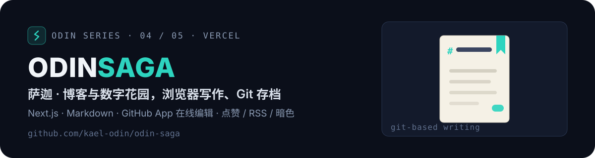

<p align="center">
  
</p>

<p align="center">
  <a href="https://odin-saga.vercel.app/"></a>
  
  
  
</p>

## ✨ 这是什么

Kael 的个人博客与数字花园（Next.js 16 App Router）：**在浏览器里写 Markdown、传图、改配置，通过 GitHub App 自动提交回仓库**——没有独立后台，所有内容最终都落在 Git 仓库里，天然版本化、可回滚。改进记录与计划见 [`docs/ROADMAP.md`](docs/ROADMAP.md)。

- **可视化写作**：拖拽/粘贴插图自动压缩 WebP、草稿自动保存、中文转拼音 slug、导入 `.pem` 即可在手机上发文
- **富内容渲染**：GFM / KaTeX / Mermaid（跟随明暗主题）/ B站 & YouTube 嵌入 / 本地 mp4 / shiki 双主题高亮 + DOMPurify 消毒
- **明暗双主题**：左下角一键切换、记忆偏好，站点主题色完整保留
- **实用小件**：点赞（服务端计数存 `likes.json`、IP 限频）、每日一签、Live2D、音乐歌单、RSS / sitemap / SEO 全套
- **内容可下线**：文章「隐藏」后列表、RSS、sitemap、直链全链路屏蔽

**线上地址**：<https://odin-saga.vercel.app/>

## 🚀 快速开始

```bash
pnpm install
pnpm dev      # http://localhost:2025
pnpm build && pnpm start
```

## ✏️ 用 GitHub App 在线编辑

1. **创建 GitHub App**（Settings → Developer settings → GitHub Apps，**不是 OAuth App**）：权限 `Contents: Read and write`，Webhook 可关；生成并下载 `.pem`，记下 App ID；安装到本仓库
2. **部署平台配环境变量**：

   | 变量 | 说明 |
   | --- | --- |
   | `NEXT_PUBLIC_GITHUB_OWNER` | `kael-odin` |
   | `NEXT_PUBLIC_GITHUB_REPO` | `odin-saga` |
   | `NEXT_PUBLIC_GITHUB_BRANCH` | `main` |
   | `NEXT_PUBLIC_GITHUB_APP_ID` | 你的 App ID |
   | `NEXT_PUBLIC_GITHUB_ENCRYPT_KEY` | 任意随机长串（浏览器端加密缓存 .pem） |
   | `NEXT_PUBLIC_SITE_URL` | 线上域名（OG / RSS / sitemap 用） |

3. **导入密钥**：打开线上站点 `/write` 页，点「导入密钥」选择 `.pem`（仅存浏览器 sessionStorage），之后发布/改配置都自动提交回仓库

内容都落在 `public/blogs/{slug}/`（正文 `index.md` + 元信息 `config.json`），站点配置在 `src/config/site-content.json`——手改文件与在线编辑两条路都通。

## 🌐 部署到 Vercel

Import 本仓库 → Framework 选 Next.js 默认配置 → 配好上面的环境变量 → Deploy。此后推送 `main` 自动构建上线。

与上游同步：`git remote add upstream https://github.com/YYsuni/2025-blog-public.git` 后 `git fetch upstream && git merge upstream/main`（建议先在分支试合并）。

## 🧭 Odin 系列

| 符 | 仓库 | 定位 | 访问 |
| --- | --- | --- | --- |
| 🌈 | [odin-bifrost](https://github.com/kael-odin/odin-bifrost) | 个人作品集主站（Next.js Bento） | [live](https://kael-odin.github.io/odin-bifrost/) |
| ⚡ | [odin-valhalla](https://github.com/kael-odin/odin-valhalla) | 深色作品集模板（React + Vite） | [live](https://kael-odin.github.io/odin-valhalla/) |
| 🗿 | [odin-runestone](https://github.com/kael-odin/odin-runestone) | 双语作品集模板（Vite + GSAP） | [live](https://kael-odin.github.io/odin-runestone/) |
| 📜 | **odin-saga** | 博客与数字花园（Next.js） | 这里 |
| 🏠 | [odin-heim](https://github.com/kael-odin/odin-heim) | OS 风互动主页模板（Vite） | [live](https://kael-odin.github.io/odin-heim/) |

> 同一套北欧神话命名 `odin-<词根>`，词根即职能：彩虹桥是入口，英灵殿陈列功绩，卢恩石碑刻生平，萨迦记事，heim 是家。

## 📄 许可与致谢

- 基于 [YYsuni/2025-blog-public](https://github.com/YYsuni/2025-blog-public)（MIT）深度定制：内容结构调整、暗色模式、点赞服务、中文体验优化等
- GitHub App 管理内容的设计思路参考原作者在 README 与博客中的介绍

---

<p align="center"><sub><b>ODIN SERIES</b> · bifrost / valhalla / runestone / saga / heim · crafted by <a href="https://github.com/kael-odin">Kael Odin</a></sub></p>
