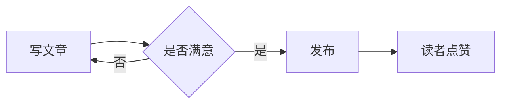

这是一篇用于验证新功能的测试文章，验证完成后会被删除。

## 数学公式

质能方程 $E = mc^2$，块级公式：

$$\int_{-\infty}^{\infty} e^{-x^2} dx = \sqrt{\pi}$$

## 代码

```ts
const greeting: string = '你好，世界'
console.log(greeting)
```

## 图表



## 视频与图片

在下面单独一行粘贴 B 站视频链接即可自动嵌入播放器：

https://www.bilibili.com/video/BV1GJ411x7h7


## 表格

| 能力 | 状态 |
| --- | --- |
| 数学公式 | ✅ |
| Mermaid | ✅ |
| 视频嵌入 | ✅ |
